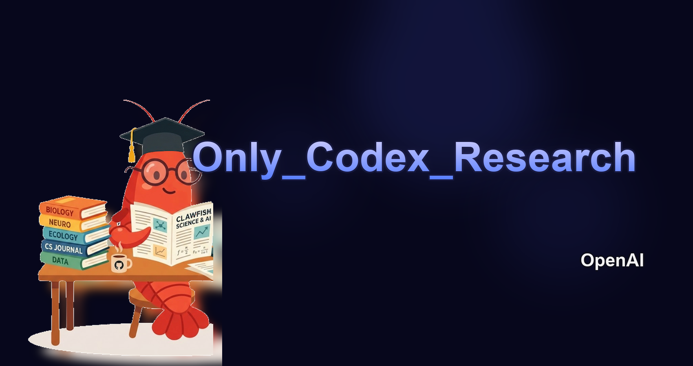

# Only_Codex_Research

[简体中文](./README.md)

[](https://github.com/RJMSWD/Only_Codex_Research)
[](https://www.python.org)
[](./LICENSE)
[](./AGENTS.md)
[](./docs/supervisor-mode.md)

<p align="center">
  
</p>

**🔥 Sign in to Codex and push an idea toward a submission-ready paper within hours.**

Only_Codex_Research is a Codex-native research automation stack. It uses filesystem-backed `supervisor` mode to coordinate the full pipeline from literature review to implementation, experiments, paper drafting, and internal review.

## Highlights

- Codex-first orchestration
- End-to-end flow: literature review -> implementation -> experiments -> paper writing -> internal review
- Built on top of the proven `AutoResearchClaw` pipeline foundations
- `supervisor` mode by default, without ACP as the primary transport
- Agent roles, responsibilities, and reasoning strength are documented in [AGENTS.md](./AGENTS.md)

## Quick Start

```bash
git clone https://github.com/RJMSWD/Only_Codex_Research.git
cd Only_Codex_Research
pip install -e .
cp config.only_codex.example.yaml config.local.yaml
```

Recommended bootstrap prompt:

```text
Read AGENTS.md and config.only_codex.example.yaml first.
Act as the lead orchestrator.
Use supervisor mode by default.
Create only the necessary sub-agents from AGENTS.md.
Keep every claim evidence-backed.
Validate the config, run doctor, and begin the end-to-end paper workflow for: <YOUR_TOPIC>.
```

Before the first real run, update `experiment.sandbox.python_path` in `config.local.yaml` so it points to an executable interpreter in the current environment.

Typical commands:

```bash
only-codex-research validate --config config.local.yaml --no-check-paths
only-codex-research doctor --config config.local.yaml
only-codex-research run --config config.local.yaml --topic "Your research topic" --auto-approve
```

## How It Works

1. Codex reads [AGENTS.md](./AGENTS.md) and learns the default role split.
2. Codex uses [config.only_codex.example.yaml](./config.only_codex.example.yaml) as the baseline config.
3. The main process writes stage requests into `.researchclaw-supervisor/requests/`.
4. Codex and its sub-agents write structured responses into `.researchclaw-supervisor/responses/`.
5. The pipeline continues through planning, literature, implementation, experiments, writing, and review.

Transport details are documented in [docs/supervisor-mode.md](./docs/supervisor-mode.md).

## Repository Map

- `researchclaw/`: core runtime package for pipeline, literature, experiment, and writing stages
- `scripts/`: helper tools for request exchange, response verification, and response replay
- `tests/`: regression tests for config, health checks, execution flow, and supervisor mode
- `docs/`: technical documentation and extended usage notes
- `config.only_codex.example.yaml`: public starter config

## Compatibility Note

The recommended public command is `only-codex-research`. The internal Python package name remains `researchclaw` for compatibility with the inherited codebase.

## Attribution

Only_Codex_Research contains derivative work based on `AutoResearchClaw` and keeps its inherited pipeline foundations while redefining the default orchestration model around Codex.
